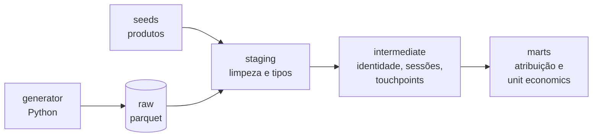

# revops-dbt


Projeto dbt de RevOps para uma fintech fictícia de renda fixa. Modela o funil completo, do clique em mídia paga até o aporte liquidado, e calcula atribuição multi-touch e unit economics por canal.

## O problema

Em operações de inside sales, a receita acontece semanas depois do primeiro clique e passa por vários sistemas que não conversam entre si. A mídia está nas plataformas de ads, o comportamento no Segment, a operação comercial no CRM e o dinheiro no backend financeiro.

Este projeto junta essas fontes num único modelo para responder

- Quanto cada canal contribuiu para os aportes, considerando a jornada inteira e não só o último clique
- Qual o CAC real por canal, medido contra dinheiro liquidado e não contra conversões reportadas pelas plataformas
- Onde o funil perde mais gente, do cadastro ao KYC, simulação e aporte

## Arquitetura



Os dados são sintéticos, gerados por um script Python que simula cinco sistemas de origem com semente fixa. O modelo de cada tabela está em [`docs/data_model.md`](docs/data_model.md).

| Camada | Modelos | O que faz |
|---|---|---|
| Staging | `stg_*` | Tipos, nomes e padronização de cada fonte |
| Intermediate | `int_identity_map`, `int_events_identified` | Liga eventos anônimos ao usuário que se cadastrou |
| Intermediate | `int_events_sessionized`, `int_sessions` | Agrupa eventos em sessões e define o canal pela entrada |
| Intermediate | `int_deal_touchpoints` | Liga cada deal às sessões dentro da janela de atribuição |
| Marts | `fct_touchpoint_attribution`, `mart_attribution_by_channel` | Crédito por toque e receita por canal em três modelos |
| Marts | `mart_channel_unit_economics` | Gasto, novos investidores, CAC, captação e ROAS por canal |

## Regras de negócio

**Atribuição position based 40/20/40.** O primeiro e o último toque recebem 40% cada, e os do meio dividem 20%. Jornadas com 2 toques dividem 50/50, e com 1 toque ele recebe 100%. First touch e last touch são calculados junto para comparação.

**Janela por deal.** Para cada deal, entram só as sessões entre a criação do deal anterior do mesmo usuário e a criação do deal atual. Cada sessão pertence a no máximo um deal.

**Sessões.** Uma sessão nova começa depois de 30 minutos sem atividade ou quando o evento chega com UTM. Eventos disparados pelo backend ficam de fora, para não criar sessões direct falsas no fim da jornada.

**Captação e receita.** O valor aportado é captação, não receita. A receita é a captação multiplicada pela taxa da var `revenue_take_rate`, uma premissa ajustável.

**CAC.** Gasto dividido por novos investidores, contando apenas o primeiro aporte liquidado de cada usuário.

Todas as regras ajustáveis estão no bloco `vars` do `revops/dbt_project.yml`.

## Resultados

Participação de cada canal na captação, conforme o modelo de atribuição.

| Canal | First touch | Position based | Last touch |
|---|---|---|---|
| Direct | 25,0% | 30,3% | 37,0% |
| Meta | 17,6% | 20,9% | 24,3% |
| Google | 24,0% | 19,7% | 14,0% |
| Organic | 16,8% | 16,0% | 15,9% |
| LinkedIn | 6,8% | 6,3% | 5,1% |
| TikTok | 5,9% | 3,6% | 1,7% |
| Bing | 3,9% | 3,1% | 2,0% |

O Google inicia muito mais jornadas do que fecha. Num modelo de último clique ele perderia quase metade do crédito.

Unit economics dos canais pagos no período.

| Canal | Gasto | CAC | ROAS sobre receita |
|---|---|---|---|
| Google | R$ 51,1 mil | R$ 790 | 0,68 |
| LinkedIn | R$ 38,4 mil | R$ 1.940 | 0,29 |
| Meta | R$ 25,0 mil | R$ 325 | 1,48 |
| Bing | R$ 7,8 mil | R$ 736 | 0,70 |
| TikTok | R$ 6,5 mil | R$ 460 | 0,98 |

O LinkedIn tem a maior taxa de cadastro da simulação e mesmo assim o pior CAC, porque o custo por clique anula a vantagem de conversão. O ROAS mede só a janela de seis meses e não substitui uma análise de LTV por coorte.

## Qualidade

89 verificações rodam a cada push no GitHub Actions, entre elas

- Unicidade e não nulidade de todas as chaves
- Integridade entre tabelas (todo deal pertence a um usuário, todo aporte a um deal ganho)
- Pesos de atribuição somando 1 em cada deal
- Receita atribuída igual ao total aportado, em todos os modelos
- Todo o gasto de mídia alocado a algum canal
- Unit test da regra 40/20/40 nos casos de 1, 2 e 4 toques

## Stack

| Camada | Ferramenta |
|---|---|
| Transformação | dbt Core |
| Warehouse | DuckDB |
| Geração de dados | Python |
| CI | GitHub Actions |

## Como rodar

Requer Python 3.14.

```bash
git clone https://github.com/viniciusfreiss/revops-dbt.git
cd revops-dbt
python3 -m venv .venv
source .venv/bin/activate
pip install -r requirements.txt
python generator/main.py
cd revops
dbt deps
dbt build
```

## Estrutura

```
revops-dbt/
├── .github/workflows/   CI
├── generator/           script que gera os dados crus
├── data/                arquivos gerados, fora do git
├── revops/              projeto dbt
│   ├── models/
│   │   ├── staging/
│   │   ├── intermediate/
│   │   └── marts/
│   ├── macros/
│   ├── seeds/
│   └── tests/
└── docs/
    ├── data_model.md
    └── decisions/
```

## Roadmap

- [x] Estrutura do projeto e conexão com DuckDB
- [x] Modelo de dados da camada raw
- [x] Gerador de dados sintéticos
- [x] Staging com testes de qualidade
- [x] Resolução de identidade
- [x] Sessionização e touchpoints
- [x] Atribuição position based
- [x] Unit economics por canal
- [x] CI com GitHub Actions
- [ ] Documentação publicada do dbt
- [ ] Análise de coorte com LTV e payback
