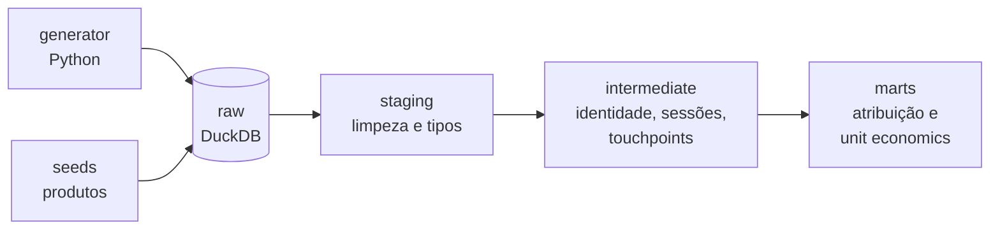

# revops-dbt

Projeto dbt de RevOps para uma fintech fictícia de renda fixa. Modela o funil completo, do clique em mídia paga até o aporte liquidado, e calcula atribuição multi-touch e unit economics por canal.

> 🚧 Em construção. O progresso está no [roadmap](#roadmap).

## O problema

Em operações de inside sales, a receita acontece semanas depois do primeiro clique e passa por vários sistemas que não conversam entre si. A mídia está nas plataformas de ads, o comportamento no Segment, a operação comercial no CRM e o dinheiro no backend financeiro.

Este projeto junta essas fontes num único modelo para responder

- Quanto cada canal contribuiu para os aportes, considerando a jornada inteira e não só o último clique
- Qual o CAC real por canal, medido contra dinheiro liquidado e não contra conversões reportadas pelas plataformas
- Onde o funil perde mais gente, do cadastro ao KYC, simulação e aporte

## Arquitetura



Os dados são sintéticos, gerados por um script Python que simula cinco sistemas de origem. O modelo de cada tabela está em [`docs/data_model.md`](docs/data_model.md).

## Atribuição

Modelo position based de 40/20/40.

- 40% para o primeiro toque, 40% para o último e 20% dividido igualmente entre os do meio
- Jornadas com 2 toques dividem 50/50, e com 1 toque ele recebe 100%
- Para cada deal, entram só os toques que aconteceram depois do deal anterior do mesmo usuário
- Todos os toques entram, incluindo orgânico e direto, e a segmentação por tipo de canal é feita na análise

## Stack

| Camada | Ferramenta |
|---|---|
| Transformação | dbt Core |
| Warehouse | DuckDB |
| Geração de dados | Python |

## Estrutura

```
revops-dbt/
├── generator/     script que gera os dados crus
├── data/          arquivos gerados, fora do git
├── revops/        projeto dbt
└── docs/
    ├── data_model.md
    └── decisions/ registro das decisões de arquitetura
```

## Como rodar

Requer Python 3.10 ou superior.

```bash
git clone https://github.com/viniciusfreiss/revops-dbt.git
cd revops-dbt
python3 -m venv .venv
source .venv/bin/activate
pip install -r requirements.txt
```

Adicione este perfil em `~/.dbt/profiles.yml`

```yaml
revops:
  outputs:
    dev:
      type: duckdb
      path: ../data/revops.duckdb
      threads: 1
  target: dev
```

E teste a conexão

```bash
cd revops
dbt debug
```

## Roadmap

- [x] Estrutura do projeto e conexão com DuckDB
- [x] Modelo de dados da camada raw
- [ ] Gerador de dados sintéticos
- [ ] Staging com testes de qualidade
- [ ] Resolução de identidade
- [ ] Sessionização e touchpoints
- [ ] Atribuição position based
- [ ] Unit economics por canal (CAC, receita, payback)
- [ ] CI com GitHub Actions
- [ ] Documentação publicada do dbt