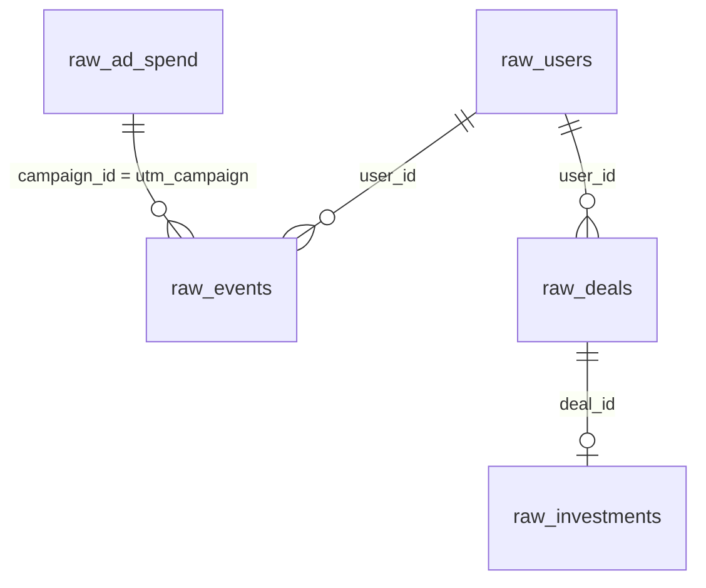

# Modelo de dados (camada raw)

Este documento descreve as tabelas cruas geradas pelo `generator/`. Cada tabela simula a saída de um sistema real da operação. Tudo que é derivado (identidade, sessões, touchpoints, atribuição) é construído pelo dbt e não aparece aqui.

## Visão geral

| Tabela | Sistema de origem | Grain |
|---|---|---|
| `raw_ad_spend` | Plataformas de mídia | uma linha por dia, canal e campanha |
| `raw_events` | Segment | uma linha por evento |
| `raw_users` | Backend do portal e do app | uma linha por usuário cadastrado |
| `raw_deals` | HubSpot | uma linha por deal |
| `raw_investments` | Backend financeiro | uma linha por aporte liquidado |

## Convenções

- Nomes em `snake_case`
- Sufixo `_id` para identificadores, `_at` para timestamps em UTC, `_date` para datas
- Valores monetários em `DECIMAL`, nunca `FLOAT`
- A camada raw guarda só métricas absolutas. Taxas (CTR, CPC, CPA) são calculadas nos marts

---

## raw_ad_spend

Gasto e entrega de mídia paga.

**Grain** uma linha por `date` + `channel` + `campaign_id`
**PK** composta (`date`, `channel`, `campaign_id`)

| Coluna | Tipo | Nulo | Descrição |
|---|---|---|---|
| `date` | DATE | não | Dia da entrega |
| `channel` | VARCHAR | não | `google`, `meta`, `tiktok`, `linkedin`, `bing` |
| `campaign_id` | VARCHAR | não | Identificador da campanha, usado como `utm_campaign` |
| `campaign_name` | VARCHAR | não | Nome legível da campanha |
| `cost` | DECIMAL(12,2) | não | Investimento no dia, em BRL |
| `impressions` | INTEGER | não | Impressões |
| `clicks` | INTEGER | não | Cliques |

Liga com `raw_events` por `campaign_id = utm_campaign`.

---

## raw_events

Eventos de comportamento no portal e no app, no formato do Segment.

**Grain** uma linha por evento
**PK** `event_id`

| Coluna | Tipo | Nulo | Descrição |
|---|---|---|---|
| `event_id` | VARCHAR | não | Identificador único do evento |
| `anonymous_id` | VARCHAR | não | Identificador do dispositivo, gerado pelo Segment |
| `user_id` | VARCHAR | sim | Preenchido a partir do cadastro |
| `event_name` | VARCHAR | não | Nome do evento (lista abaixo) |
| `event_at` | TIMESTAMP | não | Momento do evento |
| `platform` | VARCHAR | não | `web` ou `app` |
| `utm_source` | VARCHAR | sim | Preenchido só no evento de entrada |
| `utm_medium` | VARCHAR | sim | Preenchido só no evento de entrada |
| `utm_campaign` | VARCHAR | sim | Preenchido só no evento de entrada |
| `product_id` | VARCHAR | sim | Preenchido nos eventos ligados a produto |

### Eventos do funil

| `event_name` | Quando dispara |
|---|---|
| `page_viewed` | Qualquer visualização de página ou tela |
| `signup_completed` | Cadastro concluído |
| `kyc_submitted` | Envio da documentação de KYC |
| `kyc_approved` | KYC aprovado |
| `product_viewed` | Visualização de um produto |
| `simulation_completed` | Simulação de investimento concluída |
| `investment_started` | Início do fluxo de aporte |

O aporte confirmado **não** é um evento. A fonte da verdade é `raw_investments`.

### Identidade

Antes do cadastro, os eventos têm só `anonymous_id`. A partir de `signup_completed`, os eventos passam a carregar `anonymous_id` e `user_id` juntos. O dbt usa essa co-ocorrência para ligar os eventos anônimos anteriores ao usuário.

---

## raw_users

Cadastros vindos do backend.

**Grain** uma linha por usuário
**PK** `user_id`

| Coluna | Tipo | Nulo | Descrição |
|---|---|---|---|
| `user_id` | VARCHAR | não | Identificador do usuário, o mesmo no portal, no app e no HubSpot |
| `created_at` | TIMESTAMP | não | Momento do cadastro |
| `signup_platform` | VARCHAR | não | `web` ou `app` |

---

## raw_deals

Oportunidades comerciais do HubSpot. Cada deal representa um aporte em um produto.

**Grain** uma linha por deal
**PK** `deal_id`

| Coluna | Tipo | Nulo | Descrição |
|---|---|---|---|
| `deal_id` | VARCHAR | não | Identificador do deal |
| `user_id` | VARCHAR | não | Usuário dono do deal |
| `product_id` | VARCHAR | não | Produto ofertado |
| `stage` | VARCHAR | não | `novo`, `em_contato`, `proposta`, `ganho`, `perdido` |
| `created_at` | TIMESTAMP | não | Abertura do deal |
| `closed_at` | TIMESTAMP | sim | Fechamento, nulo enquanto aberto |

Guarda só o estágio atual, sem histórico de mudanças.

---

## raw_investments

Aportes liquidados, vindos do backend financeiro.

**Grain** uma linha por aporte liquidado
**PK** `transaction_id`

| Coluna | Tipo | Nulo | Descrição |
|---|---|---|---|
| `transaction_id` | VARCHAR | não | Identificador da transação |
| `deal_id` | VARCHAR | não | Deal que originou o aporte |
| `user_id` | VARCHAR | não | Usuário que aportou |
| `product_id` | VARCHAR | não | Produto aportado |
| `amount` | DECIMAL(14,2) | não | Valor em BRL |
| `settled_at` | TIMESTAMP | não | Momento da liquidação |

`user_id` e `product_id` repetem o que já está no deal. Isso é proposital, porque sistemas reais costumam duplicar essas colunas, e a consistência entre as duas tabelas vira um teste no dbt.

---

## Tabela de referência (seed)

`products` é estática e entra como seed do dbt, não pelo gerador.

| Coluna | Tipo | Descrição |
|---|---|---|
| `product_id` | VARCHAR | Identificador do produto |
| `product_name` | VARCHAR | Nome comercial |
| `product_type` | VARCHAR | `CRI`, `CRA`, `debenture`, `CCB` |